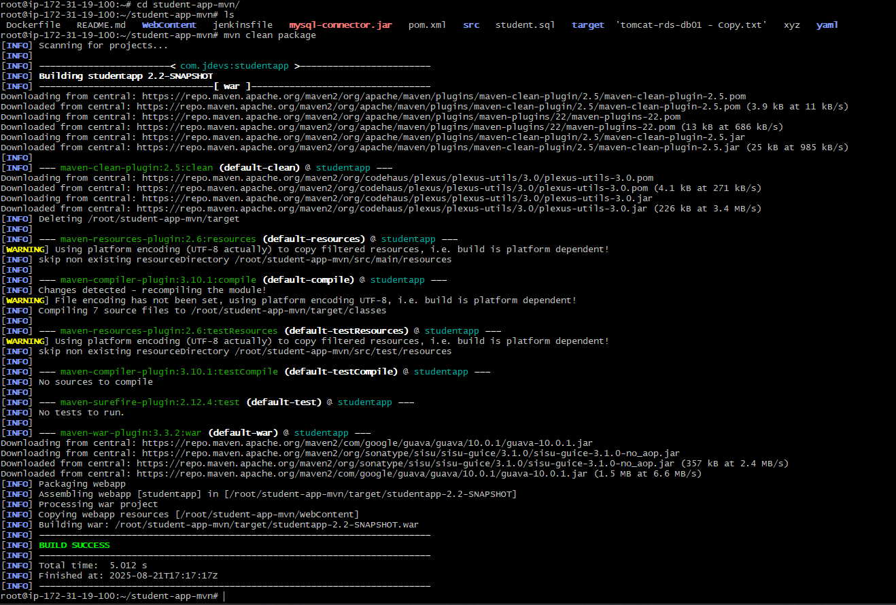
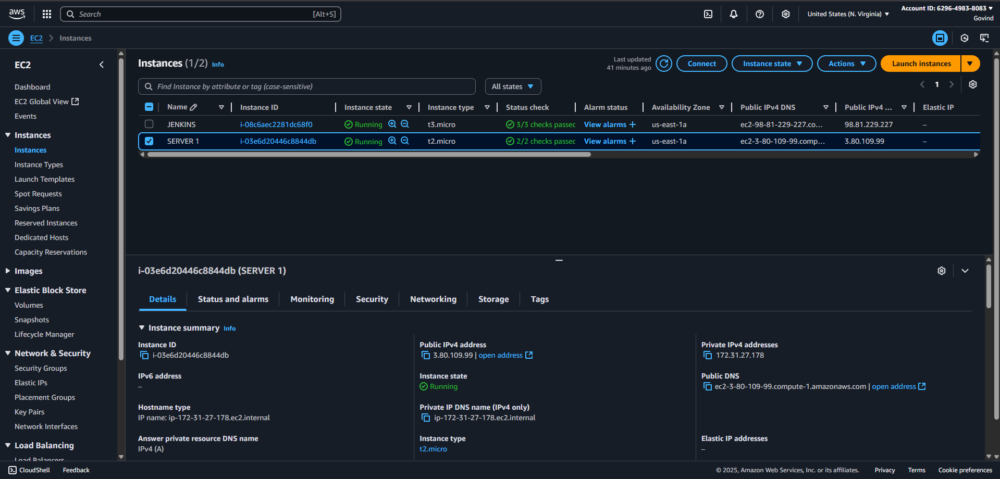
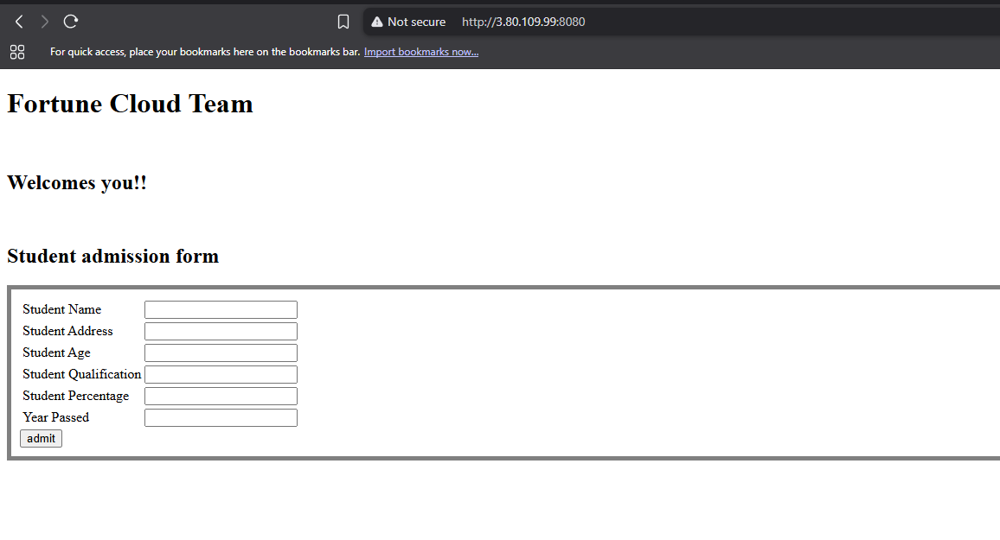

# 🎓 Student Application Deployment using Jenkins, Maven & Tomcat on AWS EC2

This project demonstrates how to deploy a **Java Student Web Application** packaged as a WAR file using **Maven**, **Jenkins CI/CD Pipeline**, and hosted on **Tomcat** running on an AWS EC2 instance.  

---

## 📌 Project Overview
- The application code is stored in **GitHub**.
- **Jenkins Pipeline** is used to:
  1. Checkout code.
  2. Build a WAR file using **Maven**.
  3. Deploy the WAR file into **Tomcat** on an AWS EC2 server.
- Once deployed, the application is accessible at:  
  👉 `http://<EC2-PUBLIC-IP>:8080/`

---

## 🛠️ Tech Stack
- **Java 17**
- **Maven** (for build and packaging)
- **Tomcat 10** (Application Server)
- **Jenkins** (CI/CD)
- **AWS EC2** (Deployment Server)

---

## 📂 POM.xml

The Maven `pom.xml` configuration for this project:

```xml
<project xmlns="http://maven.apache.org/POM/4.0.0" 
         xmlns:xsi="http://www.w3.org/2001/XMLSchema-instance" 
         xsi:schemaLocation="http://maven.apache.org/POM/4.0.0 http://maven.apache.org/xsd/maven-4.0.0.xsd">
  <modelVersion>4.0.0</modelVersion>
  <groupId>com.jdevs</groupId>
  <artifactId>studentapp</artifactId>
  <version>2.2-SNAPSHOT</version>
  <packaging>war</packaging>

  <properties>
    <maven.compiler.source>17</maven.compiler.source>
    <maven.compiler.target>17</maven.compiler.target>
  </properties>

  <build>
    <plugins>
      <!-- Compiler Plugin -->
      <plugin>
        <artifactId>maven-compiler-plugin</artifactId>
        <version>3.10.1</version>
        <configuration>
          <release>17</release>
        </configuration>
      </plugin>

      <!-- WAR Plugin -->
      <plugin>
        <groupId>org.apache.maven.plugins</groupId>
        <artifactId>maven-war-plugin</artifactId>
        <version>3.3.2</version>
        <configuration>
          <warSourceDirectory>WebContent</warSourceDirectory>
          <failOnMissingWebXml>false</failOnMissingWebXml>
        </configuration>
      </plugin>
    </plugins>
  </build>

  <dependencies>
    <!-- Servlet API -->
    <dependency>
      <groupId>javax.servlet</groupId>
      <artifactId>javax.servlet-api</artifactId>
      <version>4.0.1</version>
      <scope>provided</scope>
    </dependency>
  </dependencies>
</project>
````

---

## 📂 Jenkins Pipeline (Jenkinsfile)

The CI/CD pipeline used in Jenkins:

```groovy
pipeline {
    agent any

    environment {
        SERVER_IP    = '3.80.109.99'
        SSH_CRED_ID  = 'server'
        TOMCAT_PATH  = '/var/lib/tomcat10/webapps'
        TOMCAT_SVC   = 'tomcat10'
    }

    stages {
        stage('Checkout') {
            steps {
                git branch: 'main', url: 'https://github.com/govi888/student-app-mvn.git'
            }
        }

        stage('Build WAR') {
            steps {
                sh 'mvn clean package'
            }
        }

        stage('Deploy to Tomcat') {
            steps {
                sshagent([SSH_CRED_ID]) {
                    sh """
                        WAR_FILE=\$(ls target/*.war | head -n 1)
                        scp -o StrictHostKeyChecking=no \$WAR_FILE ubuntu@${SERVER_IP}:/tmp/
                        ssh -o StrictHostKeyChecking=no ubuntu@${SERVER_IP} '
                            sudo rm -rf ${TOMCAT_PATH}/*
                            sudo mv /tmp/*.war ${TOMCAT_PATH}/ROOT.war
                            sudo chown tomcat:tomcat ${TOMCAT_PATH}/ROOT.war
                            sudo systemctl restart ${TOMCAT_SVC}
                        '
                    """
                }
            }
        }
    }

    post {
        success {
            echo "App deployed! Visit: http://${SERVER_IP}:8080/"
        }
        failure {
            echo "Deployment failed."
        }
    }
}
```

---

## ⚡ How the Pipeline Works

1. Jenkins checks out the student app source code from GitHub.
2. Maven compiles and packages the application into a `WAR` file.
3. Jenkins securely copies the WAR file to the EC2 server.
4. Old deployments are cleaned, and the WAR is renamed to `ROOT.war`.
5. Tomcat service is restarted.
6. The app is live at `http://<EC2-IP>:8080/`.

---

## 📸 Screenshots

### 1. Jenkins Setup


### 2. Tomcat Installed



### 3. AWS EC2 Security Groups


### 4. AWS EC2 Servers



### 5. Student Application Output



---

## 🌐 Accessing the Application

After successful deployment, visit:

```
http://3.80.109.99:8080/
```

---

## 🚀 Future Enhancements

* Automate deployment on **GitHub push**.
* Dockerize the Tomcat + Student app.
* Integrate monitoring (Prometheus + Grafana).
* Add automated tests before deployment.

---


